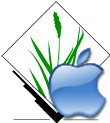
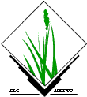

<!-- Google tag (gtag.js) -->

### _The world's best GIS for the world's best computers_

## Fully bundled Mac apps of current GRASS releases

These apps are fully 64 bit applications and include all needed helper programs (dependencies), including Python (version 2.7.x for older binaries and version 3.6 and above for GRASS versions 7.8 and higher) and wxPython (versions 3 and 4). They should work 'out of the box' without any separate "frameworks" being installed, and should work with System Integrity Protection enabled (the default for the Mac - see below).

If you are not familiar with ***GRASS GIS***, you should visit the **[ main GRASS site](http://grass.osgeo.org)** and community maintained **[GRASS WIKI](https://grasswiki.osgeo.org/wiki/GRASS-Wiki)** to take a look at its features. Used throughout the world, GRASS is one of the most powerful and comprehensive geospatial analysis, visualization, and modeling tools available. In continuous use and development for over three decades, GRASS is one of the most mature GIS programs in active use and development ....and it is freely available to all.

 As open source software, the code and all analytical algorithms can be scrutinized and improved. It is developed and maintained by an international team of geospatial scientists who also use the software in their daily work. GRASS is a founding member of the **[OSGeo Foundation](http://osgeo.org)** (Open-Source Geospatial), an umbrella organization that provides a diversity of open-source software solutions for geospatial research, mapping, and interactive use.

In addition to the Mac, GRASS runs under Linux, Unix, and Windows. Versions for these other platforms can be found at the **[downloads page](http://grass.osgeo.org/download/)** of GRASS main site. There is a very active **[GRASS community](https://grass.osgeo.org/about/community/)** where you can have questions answered, as well as extensive **[help online](https://grass.osgeo.org/learn/ )** and built into the program itself.

## GRASS Apps for the Mac

{: .align-left} Like other GRASS developers, I am a scientist and user of geospatial software, and volunteer my time to the GRASS project. If you use and like this software, I hope you will consider contributing to the project. There are many roles, even if you don't think of yourself as someone who can program. A Google Scholar list of papers reporting research projects using GRASS GIS can be found [here](https://scholar.google.com/citations?hl=en&user=gJ0ZB0cAAAAJ&view_op=list_works&sortby=pubdate).

As part of my own research and helping with GRASS development, I compile GRASS source code so that it runs on the Macintosh. I do this when time permits, so my releases can be irregular. But I do try to keep up with major developments and changes in the software. I have made several versions of GRASS Mac apps available on the downloads page.

The current ones are fully bundled with all needed dependencies included in the (larger) app and run on the newest versions of Mac OS X (10.13 and above, and possibly earlier versions of OS X).

I also maintain some legacy GRASS apps that require separate installation of some dependencies as "frameworks" (provided on the frameworks page). The oldest legacy versions will run on OS X 10.6 and above up to???. Newer legacy versions will run on OS X 10.8 and above. These legacy versions use Python 2.7 that came pre-installed on earlier versions of the Mac OS, and have a bundled wxPython 2.8.12 (for the GUI) so that you don't have to download it.

If you are interested in learning about my research, you can find more information at my [website](http://cmbarton.github.io)

## Fun GRASS History
GRASS GIS was first released on 29 July 1983 by the US Army Corps of Engineers, Construction Engineering Research Laboratories. The lead developers were Michael Shapiro, James Westervelt, Dave Gerdes, Michael Higgins, and Marjorie Larson. GRASS has been in continuous use and development for over 40 years.

{: .align-left}
[Click to watch Capt. James T. Kirk pitch GRASS in 1987](/assets/files/1987-07-17-GRASS-GIS_Shatner.mp4){:target="_blank"}  
(this is an MP4 version of a movie narrated by William Shatner)  

[Here is an article in Wired about this movie](https://www.wired.com/2013/08/shatner-loves-digital-maps/){:target="_blank"}   

Here is a copy of the [manual for GRASS 3.0 ](assets/files/grass3_manual.pdf){:target="_blank"}, released in 1989

And here are links to a [presentation](https://www.youtube.com/watch?v=olRSbZ1UpJI&t=1475s ){:target="_blank"} by GRASS developer Martin Landa and [slides](https://ctu-geoforall-lab.github.io/grass-gis-talk-foss4g-2023/foss4g2023.html#){:target="_blank"}  summarizing the state of GRASS 8.3, 40 years after the software was first released.
